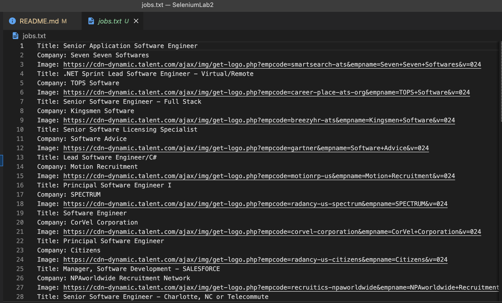
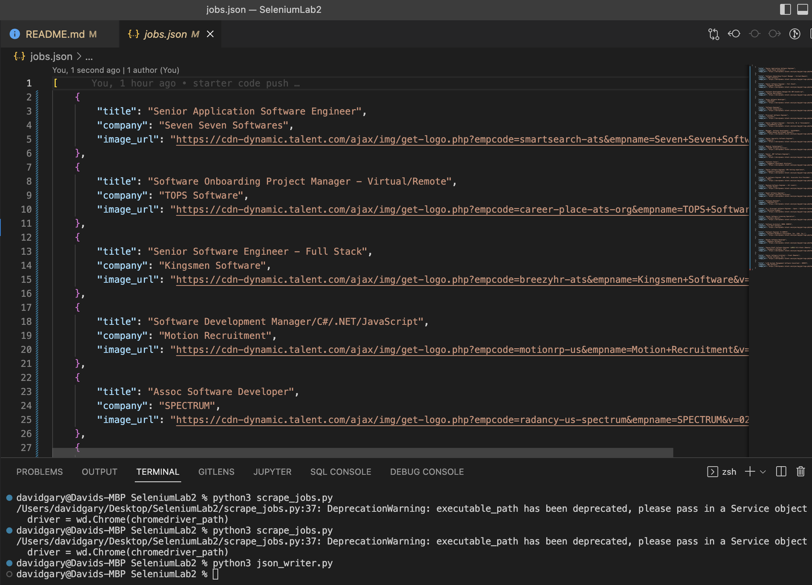
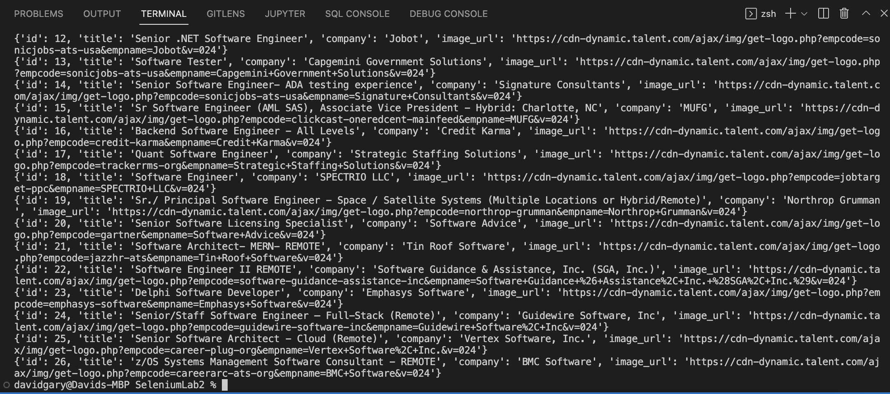

# Storing Data with JSON and SQLite

## Description

In this lab you will learn how to store scraped data in two different ways: JSON and SQLite. This will require you to use methods from the [selenium](https://selenium-python.readthedocs.io/index.html), [json](https://docs.python.org/3/library/json.html), and [sqlite3](https://docs.python.org/3/library/sqlite3.html) libraries in Python. If you have selenium installed, no other library installations are required.

## Task 4: Basic Scraping with Selenium

- Begin by opening the `scrape_jobs.py` file inside this repository.
- Finish the `create_scraping_url` function by adding a return statement that returns the URL
- Finish the `create_chromedriver_path` function by writing a correct filepath creation statement with the `os` library.
  - HINT: See the code from the previous lab for an example of how to do this.
- Finish the `scrape_jobs` function by writing the code to scrape the job data from the Talent website. It will help to read the [selenium documentation for locating elements on a page](https://selenium-python.readthedocs.io/locating-elements.html).
  - HINT: There are details for how to do this in the comments of the starter code.
  - NOTE: DO NOT CHANGE THE DICTIONARY KEY NAMES. USE WHAT IS ALREADY THERE.
- Run the `scrape_jobs.py` file and screenshot your `jobs.txt` file.
- 
  
## Task 5: Parsing to JSON

- Finish the `dict_list_to_json` function by implementing the correct `json` library method
  - HINT: See the [documentation page for the json library](https://docs.python.org/3/library/json.html) for details on how to do this.
- Run the `json_writer.py` file and screenshot your `jobs.json` file.
- 

## Task 6: Storing and Querying Data in SQLite

- Simply run the `run_database.py` file and screenshot your terminal.
- 

## Submission

- On Canvas, submit the screenshots of your `jobs.txt`, `jobs.json`, and terminal output from the `run_database.py` file.
